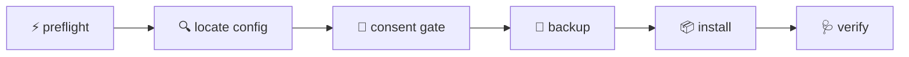

<div align="center">

# 🚀 oc-harness-setup

**The whole harness in one command.**
*MASTER orchestrator · 14 agents · 14 commands · 18 skills · a doctor that proves it.*

   

</div>

---

## ⚡ Quick start

```bash
npx --yes oc-harness-setup setup
```

> Just installed OpenCode? This lands a **working harness**: an orchestrator that triages, swarms, and reduces — with the agents, commands, skills, and health gate already wired. Plug it in. Play.

---

## 🔧 What setup does



- **Consent first** — the full manifest prints before anything moves; `--dry-run` shows it without touching a file
- **Your config survives** — `model`, providers, MCP, and plugins are preserved; everything else is curated
- **Reversible** — a SHA-256 journal records every touched file; `--uninstall` removes exactly those
- **Idempotent** — re-run anytime; identical files are skipped
- **Verified** — ends on the harness's own 16-law doctor; red = nonzero exit with the file:line that explains it

> *Installation never modifies your config by itself — setup is always an explicit command you run. **No postinstall, ever.***

---

## 📦 What you get

| | | |
|:---|:---|:---|
| 🧠 **MASTER** | dispatch tiers, parallel waves, fan-in reduction, one question per close | |
| 🤖 **14 agents** | coder · explore · reviewer · security-auditor · vault (secrets by pointer) · … | |
| ⌨️ **14 commands** | doctor · council · keeper · checkpoint · plan · build · review · ship · … | |
| 🧪 **18 skills** | spec-driven dev · TDD · debugging · security · performance · git ceremony · … | |
| 🩺 **The doctor** | 16 self-derived laws; green = consistent, regressions ≠ drift | |

---

## 🛡️ Safety by design

> Strict deny-set permissions that survive `--auto` · skills fail closed on unknown IDs · credentials stay by pointer · backup before any change.

**Optional add-on:** [`oc-freedom-fleet`](https://github.com/nathwn12/oc-freedom-fleet) — typed JEV sidecar + free-model lanes.

---

<div align="center">

OpenCode V2 · Node ≥ 22 · Windows / macOS / Linux (config path auto-resolved)

**MIT © 2026 nathwn12** · For OpenCode. Free.

</div>
